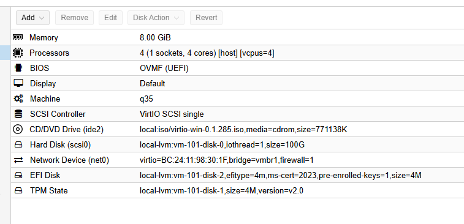
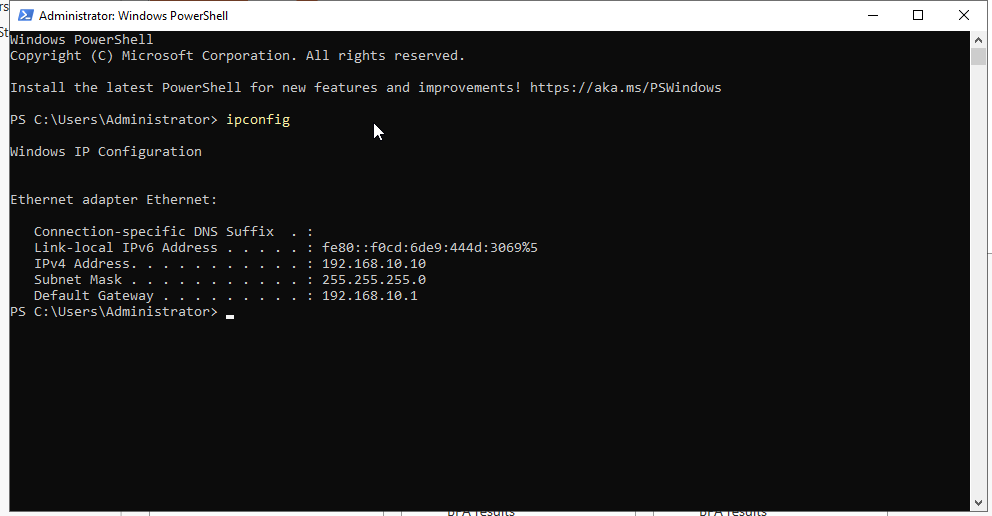
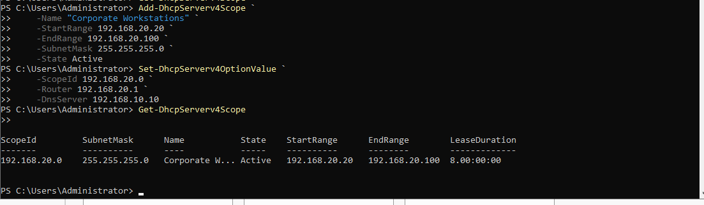
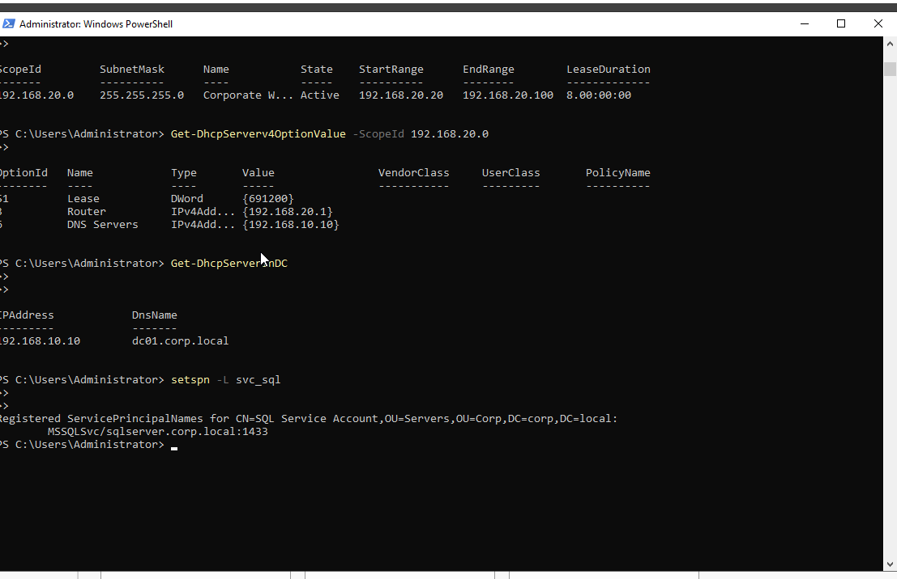
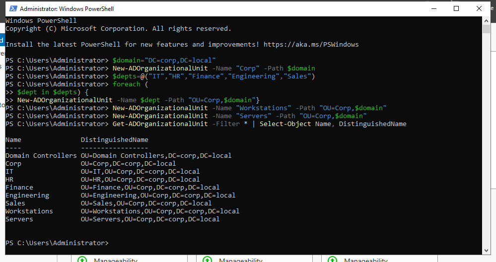

# DC01 Build

**OS:** Windows Server 2022 (Desktop Experience)
**IP:** 192.168.10.10/24
**Gateway:** 192.168.10.1 (OPNsense OPT2)
**Domain:** corp.local

## Proxmox VM Configuration

DC01 was created with OVMF (UEFI), TPM 2.0, and a VirtIO SCSI single disk. The VirtIO driver ISO was mounted alongside the Windows Server ISO at creation time so drivers are available immediately during OS installation.



**VM specs:**

| Setting | Value |
|---|---|
| Machine | q35 |
| BIOS | OVMF (UEFI) |
| TPM | v2.0 |
| Disk | 100 GB VirtIO SCSI single |
| CPU | 4 vCPUs (host type) |
| RAM | 8 GB |
| Network | vmbr1 (VirtIO) |

> During initial creation the Cores field defaulted to 1. This is a Proxmox UI behavior where Sockets and Cores are separate fields. Set Cores to 4 with Sockets at 1. The VM must be powered off to change CPU count.

## Phase 1 - Static IP and Rename

After OS installation and VirtIO guest agent setup, the static IP was configured and the machine was renamed before domain promotion.

```powershell
# Install VirtIO guest agent (mount VirtIO ISO first)
Start-Process "D:\virtio-win-guest-tools.exe" -Wait

# Set static IP
New-NetIPAddress -InterfaceAlias "Ethernet" -IPAddress 192.168.10.10 -PrefixLength 24 -DefaultGateway 192.168.10.1
Set-DnsClientServerAddress -InterfaceAlias "Ethernet" -ServerAddresses 127.0.0.1

# Rename and restart
Rename-Computer -NewName "DC01" -Restart
```



## Phase 2 - Domain Promotion

```powershell
# Install AD DS role
Install-WindowsFeature -Name AD-Domain-Services -IncludeManagementTools

# Promote to DC and create the forest
Install-ADDSForest `
    -DomainName "corp.local" `
    -DomainNetbiosName "CORP" `
    -ForestMode "WinThreshold" `
    -DomainMode "WinThreshold" `
    -InstallDns:$true `
    -SafeModeAdministratorPassword (ConvertTo-SecureString "<DSRM-PASSWORD>" -AsPlainText -Force) `
    -Force:$true
```

The server restarts automatically after promotion. After reboot the domain is CORP\Administrator.

## Phase 3 - DHCP

DHCP was installed on DC01 to serve IP addresses to workstations on the vmbr2 subnet. The scope covers 192.168.20.20 through 192.168.20.100, with the default gateway pointing to OPNsense LAN (192.168.20.1) and DNS pointing to DC01 (192.168.10.10).

```powershell
# Install DHCP role
Install-WindowsFeature -Name DHCP -IncludeManagementTools

# Authorize in AD
Add-DhcpServerInDC -DnsName "DC01.corp.local" -IPAddress 192.168.10.10

# Create scope
Add-DhcpServerv4Scope `
    -Name "Corporate Workstations" `
    -StartRange 192.168.20.20 `
    -EndRange 192.168.20.100 `
    -SubnetMask 255.255.255.0 `
    -State Active

# Set scope options
Set-DhcpServerv4OptionValue `
    -ScopeId 192.168.20.0 `
    -Router 192.168.20.1 `
    -DnsServer 192.168.10.10
```



### DHCP Verification

```powershell
Get-DhcpServerv4Scope
Get-DhcpServerInDC
setspn -L svc_sql
```



> The DHCP scope is on the vmbr2 subnet (192.168.20.x) but DC01 lives on vmbr1 (192.168.10.x). The DC can serve DHCP across the segment boundary once OPNsense is routing between vmbr1 and vmbr2 via the DHCP relay in OPNsense.

## Phase 4 - OU Structure

The OU hierarchy mirrors a real company org chart. Department OUs sit under a top-level Corp OU, with separate Workstations and Servers OUs for computer objects.

```powershell
$domain = "DC=corp,DC=local"

# Top-level OU
New-ADOrganizationalUnit -Name "Corp" -Path $domain

# Department OUs
$depts = @("IT","HR","Finance","Engineering","Sales")
foreach ($dept in $depts) {
    New-ADOrganizationalUnit -Name $dept -Path "OU=Corp,$domain"
}

# Computer OUs
New-ADOrganizationalUnit -Name "Workstations" -Path "OU=Corp,$domain"
New-ADOrganizationalUnit -Name "Servers" -Path "OU=Corp,$domain"

# Verify
Get-ADOrganizationalUnit -Filter * | Select-Object Name, DistinguishedName
```


