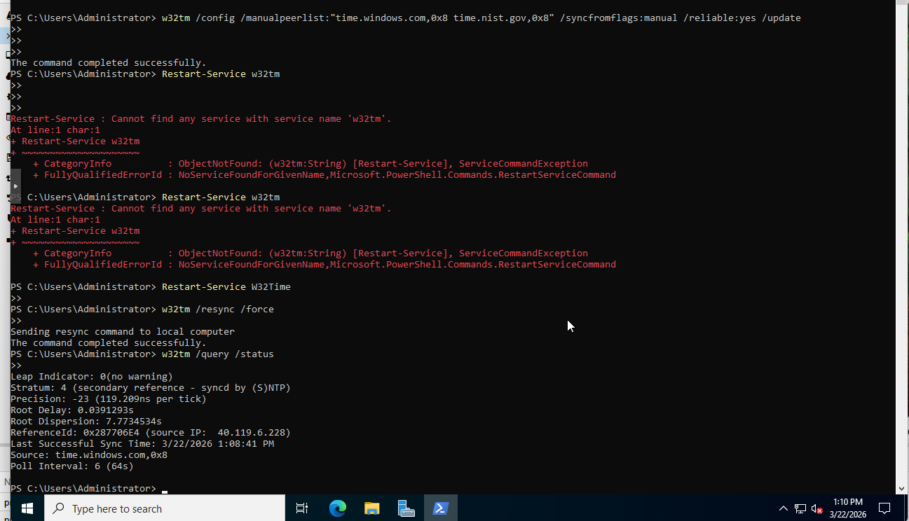
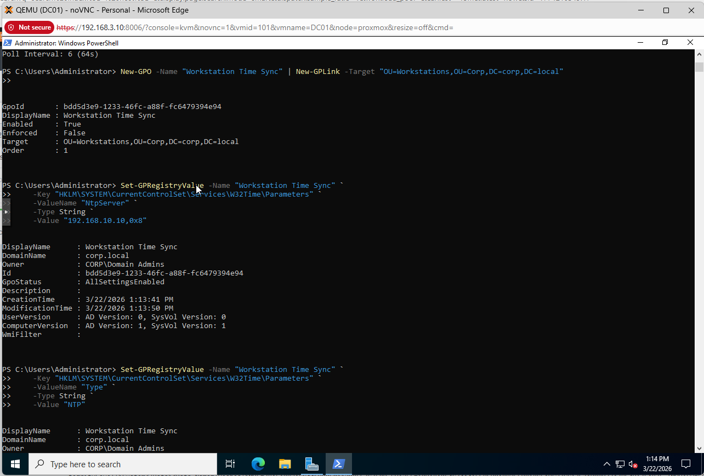
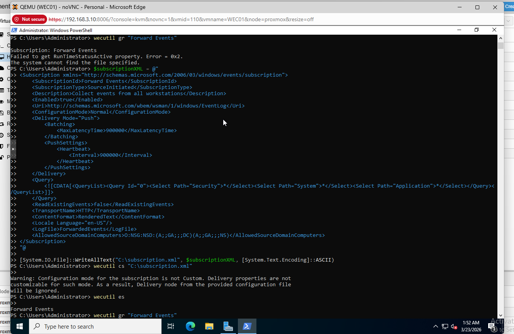

# GPO and Windows Event Forwarding

Two Group Policy Objects were created on DC01. The first enforces NTP synchronization across all workstations. The second configures Windows Event Forwarding so every workstation automatically pushes logs to WEC-01 the moment it joins the domain, without any per-machine configuration.

Time synchronization is a hard dependency for this lab. Timestamp mismatches across VMs cause correlated alerts to appear out of sequence in Splunk, making attack chain reconstruction unreliable. The NTP GPO was deployed before any workstations joined the domain.

## GPO 1 - Workstation Time Sync

This GPO points all workstations in the Workstations OU to DC01 as their NTP source, ensuring all Windows event timestamps are synchronized.

```powershell
# Create and link the GPO to the Workstations OU
New-GPO -Name "Workstation Time Sync" | New-GPLink -Target "OU=Workstations,OU=Corp,DC=corp,DC=local"

# Set DC01 as the NTP server
Set-GPRegistryValue -Name "Workstation Time Sync" `
    -Key "HKLM\SYSTEM\CurrentControlSet\Services\W32Time\Parameters" `
    -ValueName "NtpServer" `
    -Type String `
    -Value "192.168.10.10,0x8"

Set-GPRegistryValue -Name "Workstation Time Sync" `
    -Key "HKLM\SYSTEM\CurrentControlSet\Services\W32Time\Parameters" `
    -ValueName "Type" `
    -Type String `
    -Value "NTP"
```

NTP was also verified on DC01 itself before applying the GPO to ensure workstations are syncing to a reliable source.

```powershell
# On DC01 - set upstream NTP and verify sync
w32tm /config /manualpeerlist:"time.windows.com,0x8 time.nist.gov,0x8" /syncfromflags:manual /reliable:yes /update
Restart-Service W32Time
w32tm /resync /force
w32tm /query /status
```





## GPO 2 - Windows Event Forwarding

WEF uses a source-initiated subscription model. Workstations push events to WEC-01 automatically once the GPO is applied. WEC-01 then forwards aggregated events to Splunk.

### Prerequisites

WEC-01 must be fully configured and the Windows Event Collector service running before this GPO is pushed. If workstations try to register before WEC-01 is ready, subscriptions will silently fail with no error visible on the workstation.

The OPNsense LAN firewall rule explicitly allows port 5985 (HTTP/WinRM) from LAN net to 192.168.20.10 (WEC-01). This must be in place before workstations can push events.

### WEF Subscription (configured on WEC-01)

The subscription was created on WEC-01 using `wecutil`. It collects Security, System, and Application channels from all domain workstations and delivers them to the ForwardedEvents log.

```powershell
# On WEC-01 - create the subscription XML
$subscriptionXML = @"
<Subscription xmlns="http://schemas.microsoft.com/2006/03/windows/events/subscription">
  <SubscriptionId>Forward Events</SubscriptionId>
  <SubscriptionType>SourceInitiated</SubscriptionType>
  <Description>Collect events from all workstations</Description>
  <Enabled>true</Enabled>
  <Uri>http://schemas.microsoft.com/wbem/wsman/1/windows/EventLog</Uri>
  <ConfigurationMode>Normal</ConfigurationMode>
  <Delivery Mode="Push">
    <Batching>
      <MaxLatencyTime>900000</MaxLatencyTime>
    </Batching>
    <PushSettings>
      <Heartbeat>
        <Interval>900000</Interval>
      </Heartbeat>
    </PushSettings>
  </Delivery>
  <Query>
    <![CDATA[<QueryList><Query Id="0"><Select Path="Security">*</Select><Select Path="System">*</Select><Select Path="Application">*</Select></Query></QueryList>]]>
  </Query>
  <ReadExistingEvents>false</ReadExistingEvents>
  <TransportName>HTTP</TransportName>
  <ContentFormat>RenderedText</ContentFormat>
  <Locale Language="en-US"/>
  <LogFile>ForwardedEvents</LogFile>
  <AllowedSourceDomainComputers>O:NSG:NSD:(A;;GA;;;DC)(A;;GA;;;NS)</AllowedSourceDomainComputers>
</Subscription>
"@

[System.IO.File]::WriteAllText("C:\subscription.xml", $subscriptionXML, [System.Text.Encoding]::ASCII)
wecutil cs "C:\subscription.xml"
wecutil es
wecutil gr "Forward Events"
```



### GPO to Push WEF Configuration to Workstations

A separate GPO was created on DC01 to configure the WinRM service and point workstations to WEC-01.

```powershell
# On DC01 - create and configure the WEF GPO
$wefGPO = New-GPO -Name "Windows Event Forwarding"
New-GPLink -Name "Windows Event Forwarding" -Target "OU=Workstations,OU=Corp,DC=corp,DC=local"

# Enable WinRM service on workstations via GPO
Set-GPRegistryValue -Name "Windows Event Forwarding" `
    -Key "HKLM\SYSTEM\CurrentControlSet\Services\WinRM" `
    -ValueName "Start" -Type DWord -Value 2

# Set the event collector server
Set-GPRegistryValue -Name "Windows Event Forwarding" `
    -Key "HKLM\SOFTWARE\Policies\Microsoft\Windows\EventLog\EventForwarding\SubscriptionManager" `
    -ValueName "1" `
    -Type String `
    -Value "Server=http://192.168.20.10:5985/wsman/SubscriptionManager/WEC,Refresh=60"
```

Once workstations join the domain and receive this GPO, they automatically register with WEC-01 and begin forwarding Security, System, and Application event logs. No per-workstation configuration is required.
