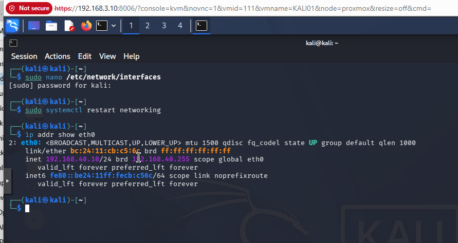
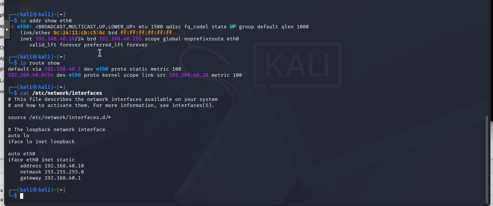
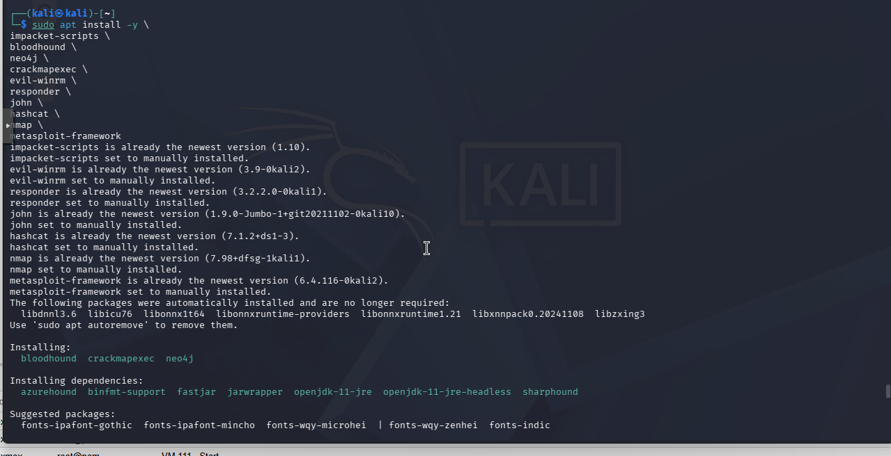
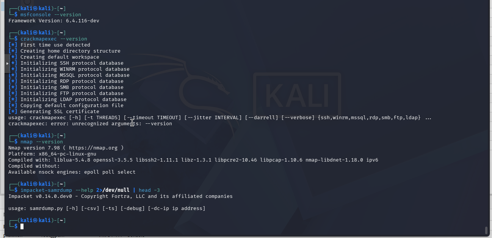
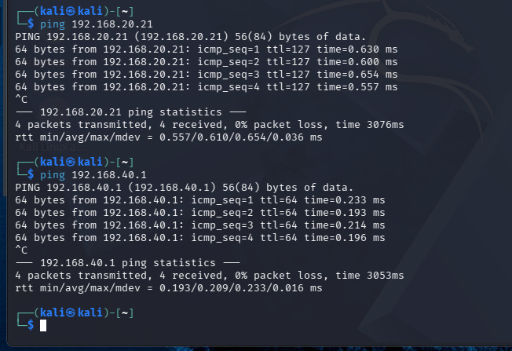
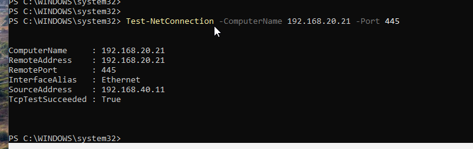

# Attacker VMs - KALI-01 and WIN-ATK

**Bridge:** vmbr4 (192.168.40.0/24)
**Gateway:** 192.168.40.1 (OPNsense WAN interface)

Both attacker VMs live on the isolated attacker network. OPNsense WAN rules permit traffic from vmbr4 to the corporate workstations (192.168.20.0/24) and the honeypot (192.168.30.130), and block everything else. All attacker traffic transits through OPNsense and is inspected by Suricata before reaching any target.

The attacker network has no path to DC01, SIEM-01, or the Proxmox management interface.

## KALI-01

**OS:** Kali Linux
**IP:** 192.168.40.10/24
**Gateway:** 192.168.40.1

### Network Configuration

The network interface was configured with a static IP using `/etc/network/interfaces`.

```bash
# /etc/network/interfaces
auto eth0
iface eth0 inet static
    address 192.168.40.10
    netmask 255.255.255.0
    gateway 192.168.40.1

# Apply
sudo systemctl restart networking
ip addr show eth0
```





### Tool Installation

**Metasploit Framework**

```bash
sudo apt update && sudo apt install -y metasploit-framework
```



**Impacket**

Impacket is the primary toolkit for Active Directory attacks including Kerberoasting, Pass-the-Hash, and secretsdump. It was installed via pip into the system Python environment.

```bash
pip3 install impacket
```



### Connectivity Verification

KALI-01 was verified to reach the corporate workstation subnet and its own gateway after static IP configuration.

```bash
ping 192.168.20.21  # WS01
ping 192.168.40.1   # OPNsense WAN gateway
```



## WIN-ATK

**OS:** Windows 10
**IP:** 192.168.40.11/24
**Gateway:** 192.168.40.1

WIN-ATK provides a Windows-native attack platform for techniques that are more natural from a Windows host, including Mimikatz, Rubeus, and C2 framework staging. It shares the vmbr4 network with KALI-01.

### Connectivity Verification

After static IP assignment, WIN-ATK connectivity to the corporate workstation network was verified by testing SMB (port 445) to WS01. A successful TcpTestSucceeded response confirms the OPNsense WAN rule is correctly permitting traffic and routing is working end-to-end.

```powershell
Test-NetConnection -ComputerName 192.168.20.21 -Port 445
```



## Attack Path Summary

```
KALI-01 (192.168.40.10)  --\
                             |--> OPNsense WAN (vtnet4) --> Suricata inspection --> OPNsense LAN (vtnet2) --> WS01-WS06
WIN-ATK (192.168.40.11)  --/
```

Every packet originating from vmbr4 and destined for vmbr2 is inspected by Suricata. This means attack traffic and the IDS alert it generates arrive in Splunk simultaneously, enabling correlated network and endpoint telemetry for each simulated attack scenario.
