# FW01 - OPNsense

FW01 is the most critical VM in the lab. It owns all inter-VLAN routing, runs Suricata inline on the attacker-to-corporate traffic path, and hosts ntopng for traffic visualization. Nothing communicates between segments without passing through this VM.

**Version:** OPNsense 26.1.2 (amd64)

## Installation

OPNsense is FreeBSD-based and has native VirtIO support, so no driver ISO is needed. The standard UFS installer had a partition initialization conflict with the VirtIO SCSI controller. Switching to ZFS installation resolved it immediately since ZFS handles disk initialization independently.

**Install method:** ZFS, stripe (single disk)
**Disk:** 40 GB (da0)
**Swap:** 8 GB (auto-sized at 2x RAM)

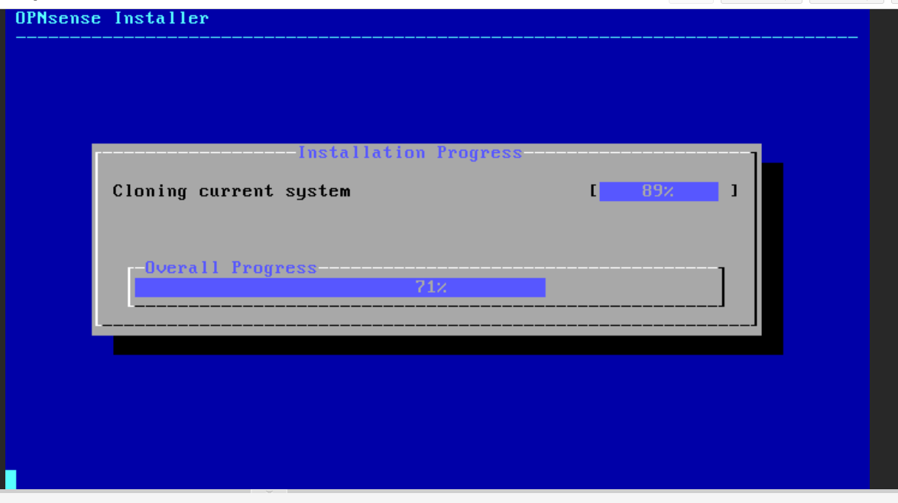

After installation, eject the ISO before the first boot. OPNsense (FreeBSD) will loop back into the installer if the CD/DVD drive is still attached.

## Interface Assignment

On first boot, OPNsense had only two interfaces assigned from the default install (LAN on vtnet0, WAN on vtnet1). These were incorrect. All five interfaces were reassigned via the console menu (option 1).

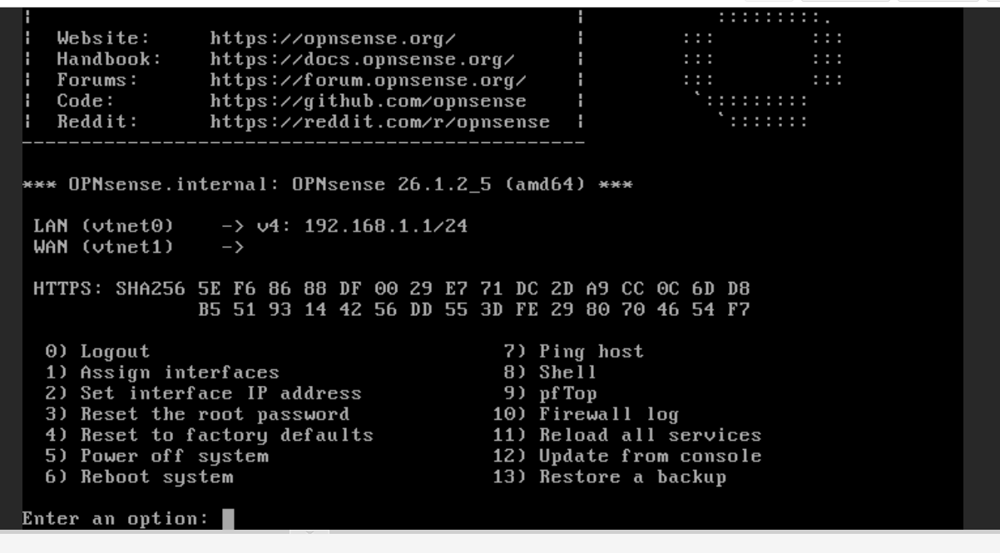

### Correct Assignment

```
WAN  -> vtnet4  (vmbr4 - attacker network, treated as untrusted)
LAN  -> vtnet2  (vmbr2 - corporate workstations)
OPT1 -> vtnet0  (vmbr0 - management / SIEM link)
OPT2 -> vtnet1  (vmbr1 - domain controller)
OPT3 -> vtnet3  (vmbr3 - DMZ / honeypots)
```

The logic: WAN is the untrusted side, which maps to the attacker network. LAN is the most protected internal segment, which maps to corporate workstations. Everything else is an optional interface.

### IP Address Assignment (console option 2)

Each interface was assigned a static IP to match the subnet plan.

| Interface | vtnet | IP | Subnet |
|---|---|---|---|
| LAN | vtnet2 | 192.168.20.1 | 192.168.20.0/24 |
| OPT1 | vtnet0 | 10.0.0.1 | 10.0.0.0/24 |
| OPT2 | vtnet1 | 192.168.10.1 | 192.168.10.0/24 |
| OPT3 | vtnet3 | 192.168.30.1 | 192.168.30.0/24 |
| WAN | vtnet4 | 192.168.40.1 | 192.168.40.0/24 |

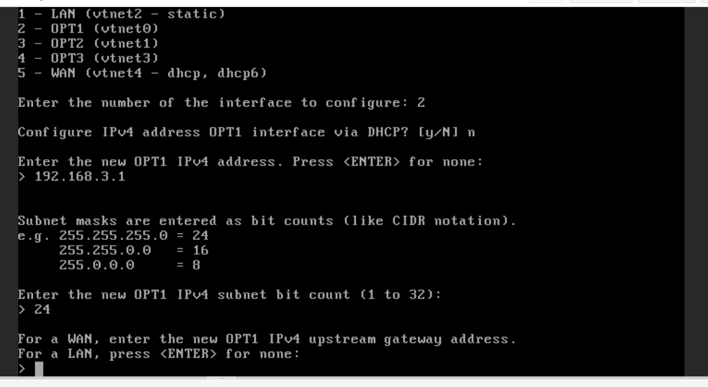

After all IPs were set, pf was verified as running.

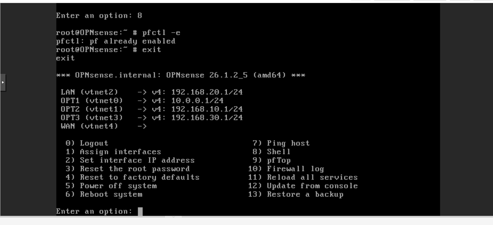

### Final Interface State

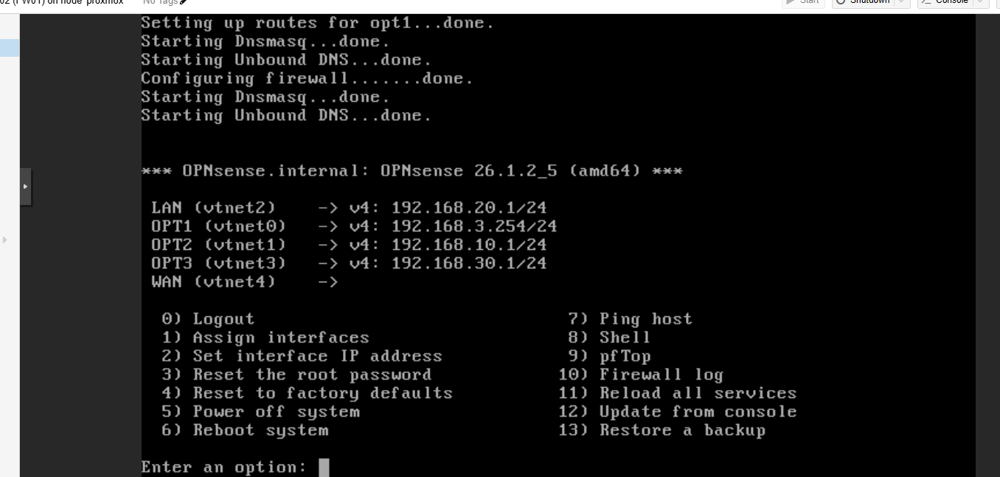

## DNS Configuration

Unbound DNS was enabled on all interfaces to provide internal name resolution across every segment.

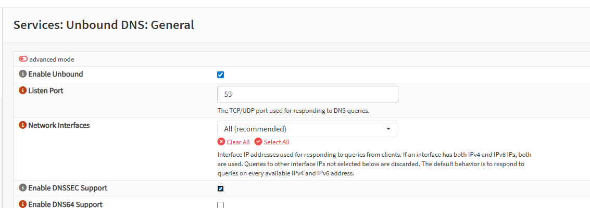

## Firewall Rules

Rules are evaluated on a first-match basis. The ordering within each interface is intentional.

### WAN (Attacker Network - vtnet4)

The attacker network can reach corporate workstations and the honeypot. It cannot reach DC01, SIEM-01, or the management network. This ensures all attack traffic is inspected by Suricata before reaching targets, while the SIEM remains a non-target.

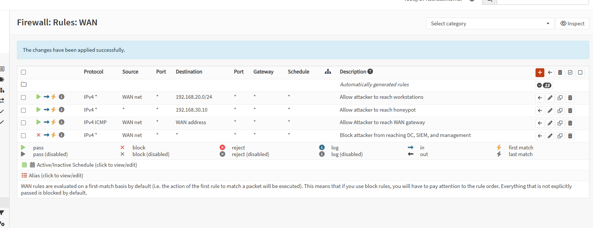

### LAN (Corporate Workstations - vtnet2)

Workstations can reach the DC for authentication and DNS, the SIEM on port 9997 for log forwarding, and WEC-01 on port 5985 for WEF. All other outbound traffic including internet access is blocked.

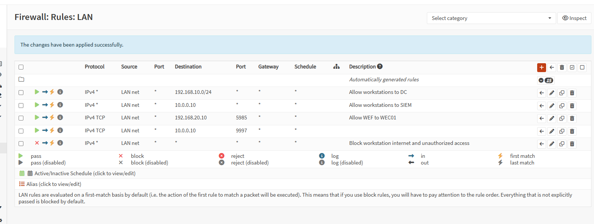

### OPT2 (Domain Controller - vtnet1)

DC01 can serve workstations and forward logs to the SIEM. It cannot reach the attacker network or DMZ.

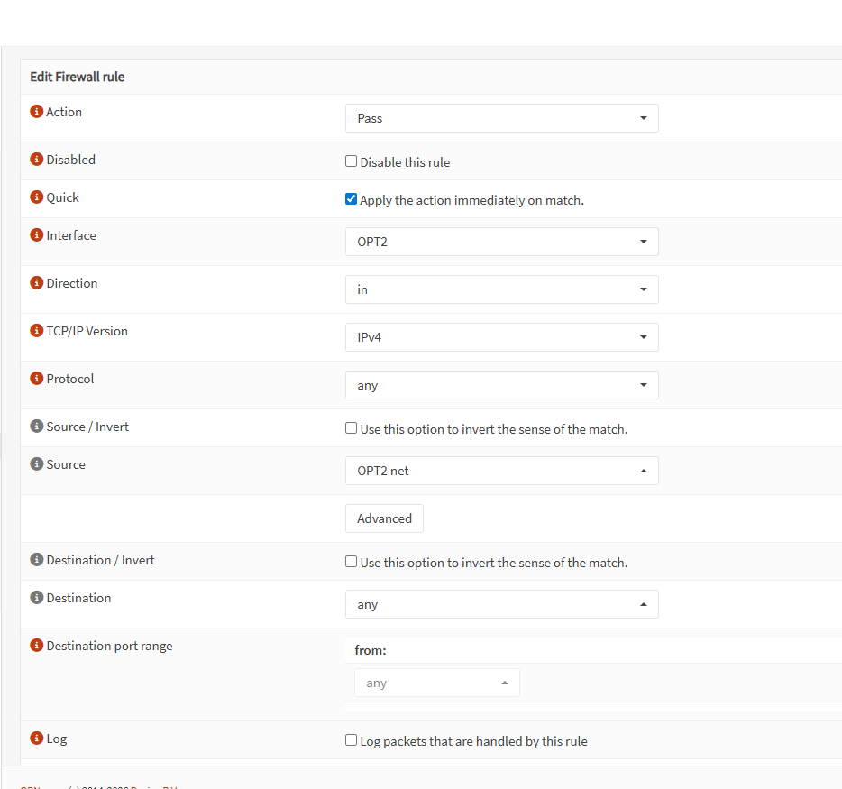

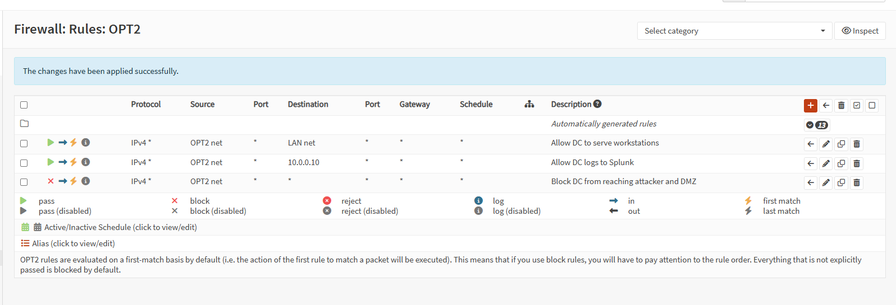

### OPT3 (DMZ - vtnet3)

The DMZ network is isolated. Honeypots and Zeek can only forward logs to the SIEM. They cannot initiate connections to any other segment.

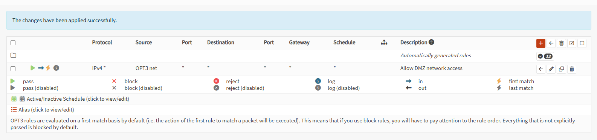

## Suricata (Intrusion Detection)

Suricata runs in PCAP live mode (IDS) on the LAN and WAN interfaces. This means every packet crossing from the attacker network into the workstation segment is inspected. Alerts are forwarded to Splunk via syslog in EVE JSON format.

### Initial State (Before Configuration)

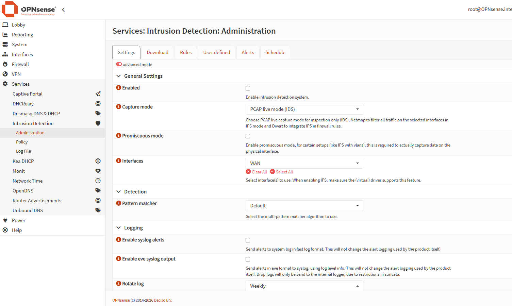

### Enabled Configuration

Suricata was enabled with Hyperscan as the pattern matcher (best performance on the Threadripper). Interfaces set to LAN and WAN to cover both sides of the attack path. Syslog alerts and EVE syslog output both enabled so alerts reach Splunk.

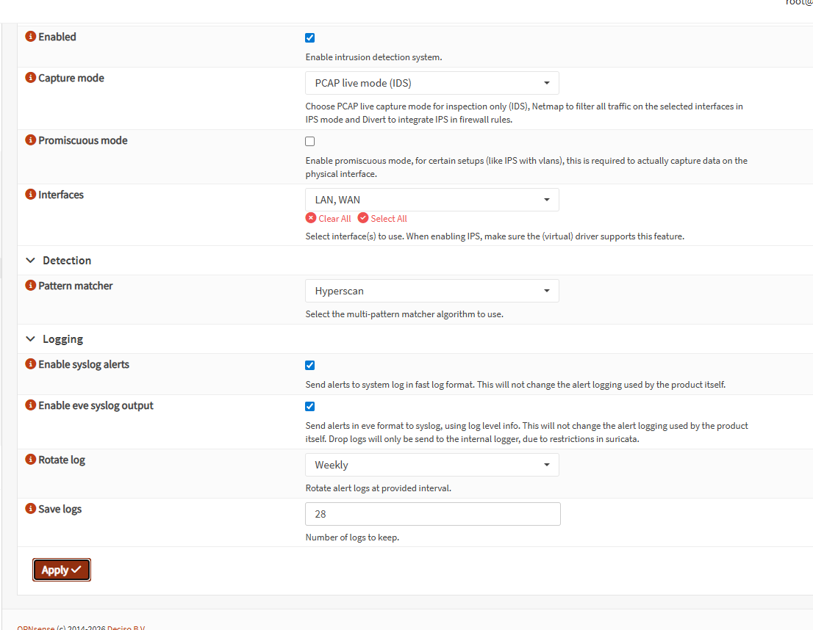

### Logging Configuration

HTTP and TLS extended logging were both enabled to capture full protocol metadata in the EVE log.

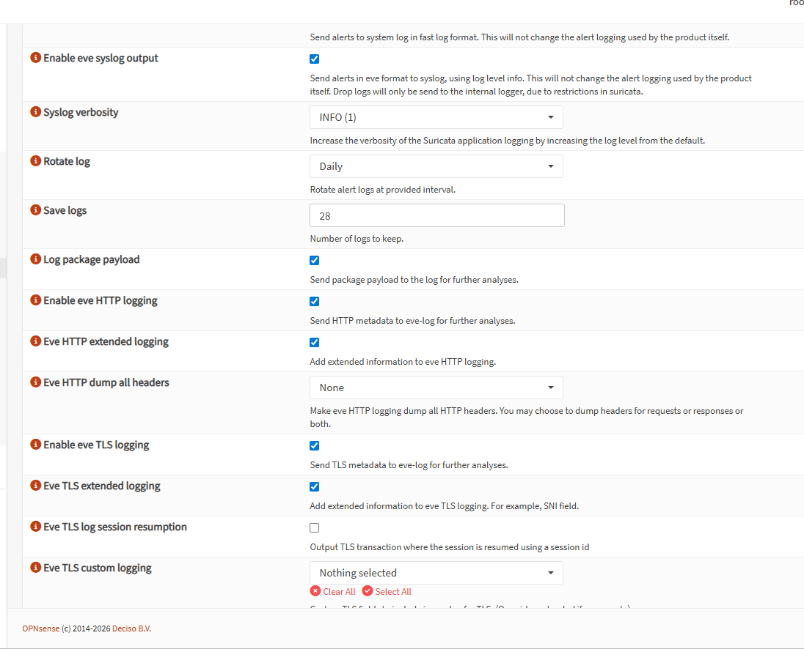

### ET Open Rules

The Emerging Threats Open ruleset was downloaded and loaded. Total rule count: 34,564 rules across categories including scan detection, exploit, and suspicious login.

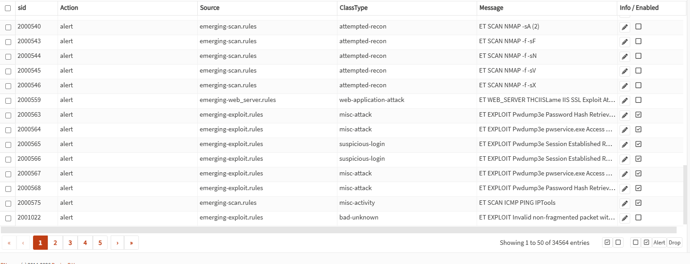

## ntopng (Traffic Visualization)

ntopng was installed as an OPNsense plugin and configured to monitor vtnet2 (the corporate workstation segment). It provides real-time flow data, top talkers, and application classification.

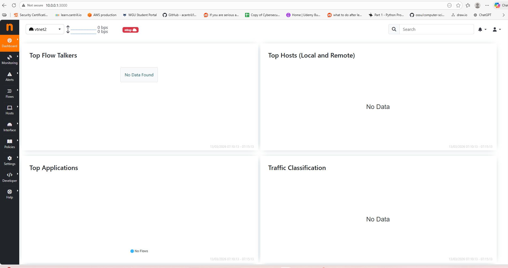
