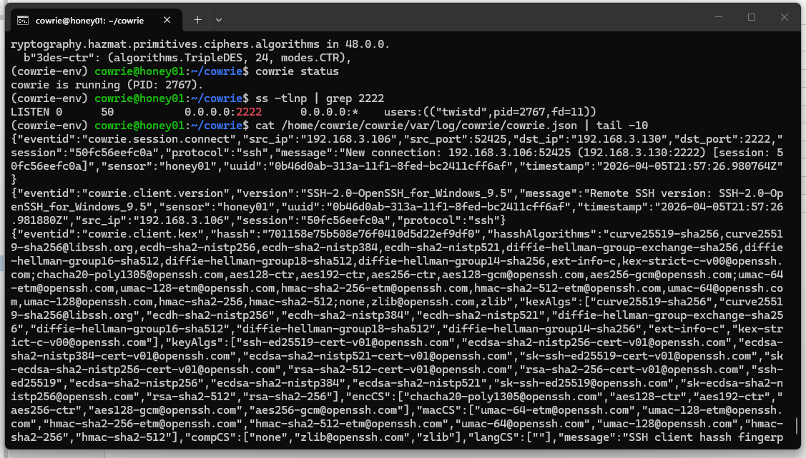
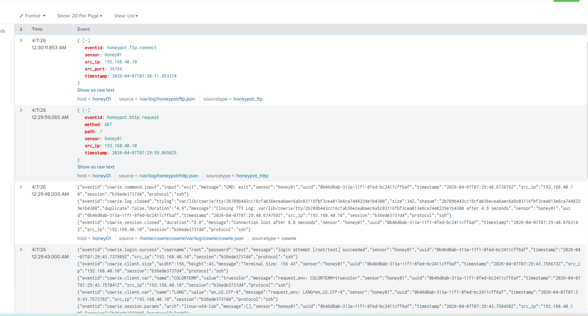
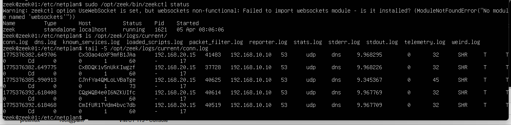

# Honeypot, DMZ, and Network Sensor - HONEY01 and ZEEK-01

HONEY01 lives on the DMZ (vmbr3, 192.168.30.0/24, OPNsense OPT3) and presents false attack surfaces, logging every interaction. ZEEK-01 lives on the workstation segment (vmbr2, 192.168.20.0/24) and passively analyzes traffic where the actual attack chains occur. Both forward logs to Splunk. HONEY01 cannot initiate connections to any other segment — OPT3 firewall rules permit only outbound log traffic to SIEM-01. ZEEK-01 is a passive sensor only and does not initiate connections outside its segment.

## HONEY01 - Cowrie SSH Honeypot

**IP:** 192.168.30.130/24

Cowrie is a medium-interaction SSH and Telnet honeypot. It emulates a Unix shell, logs every command an attacker runs, captures credentials, and records session replays. Any connection to HONEY01 on port 2222 is from a host that has no legitimate reason to be there. Zero false positives by design.

### Installation

```bash
# Install dependencies
sudo apt update
sudo apt install -y python3 python3-venv git

# Clone and set up Cowrie
git clone https://github.com/cowrie/cowrie.git /home/cowrie/cowrie
cd /home/cowrie/cowrie
python3 -m venv cowrie-env
source cowrie-env/bin/activate
pip install -r requirements.txt

# Copy and configure
cp etc/cowrie.cfg.dist etc/cowrie.cfg

# Start
bin/cowrie start
```

### Verification

```bash
cowrie status
ss -tlnp | grep 2222
cat /home/cowrie/cowrie/var/log/cowrie/cowrie.json | tail -10
```



The Cowrie JSON log shows a new SSH connection from the SIEM-01 management IP (192.168.3.106) used to verify the honeypot was reachable. The log records the event ID, source IP, source port, destination port, protocol, session ID, sensor name, and full client key exchange fingerprint.

### Log Forwarding to Splunk

The Splunk Universal Forwarder on HONEY01 monitors the Cowrie JSON log directory and forwards events to the `honeypot` index.

```
[monitor:///home/cowrie/cowrie/var/log/cowrie/cowrie.json]
index = honeypot
sourcetype = cowrie
```



## ZEEK-01 - Network Sensor

**IP:** 192.168.20.15/24
**Bridge:** vmbr2 (Corporate Workstations)
**OS:** Ubuntu

Zeek sits on the workstation segment (vmbr2) and passively monitors all traffic on that bridge. This placement gives it direct visibility into workstation-to-workstation lateral movement, workstation-to-DC authentication traffic, and inbound attack traffic from the attacker network once it reaches the corporate segment. Unlike Suricata (signature-based), Zeek produces protocol-level behavioral logs — connections, DNS queries, HTTP requests, TLS sessions — with no inherent alerting. This data feeds into correlation queries in Splunk that look for anomalous protocol behavior that signature rules might not catch.

### Installation

```bash
# Install Zeek
sudo apt install -y zeek

# Configure interface in /etc/zeek/zeekctl.cfg
# interface = eth0

# Deploy and start
zeekctl deploy
zeekctl status
```

### Verification

```bash
zeekctl status
ls /opt/zeek/logs/current/
tail -5 /opt/zeek/logs/current/conn.log
```



The conn.log shows DNS queries (UDP port 53) from workstations on 192.168.20.x to DC01 at 192.168.10.10. ZEEK-01 is on the same segment as the workstations (vmbr2), so this traffic is captured directly at the source before it ever exits the segment.

### Log Forwarding to Splunk

The Splunk UF on ZEEK-01 monitors the current log directory and forwards to the `zeek` index.

```
[monitor:///opt/zeek/logs/current/]
index = zeek
sourcetype = zeek
```
