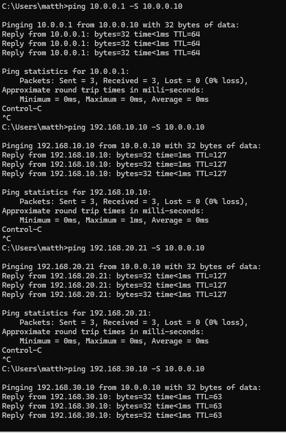
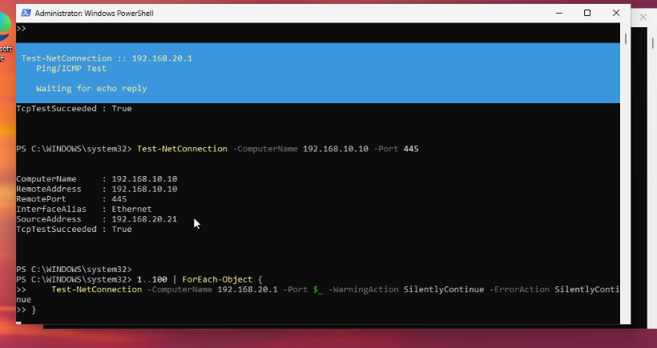
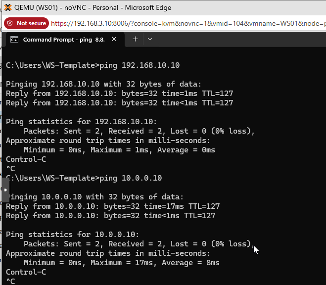

# Network Audit

Final end-to-end verification of connectivity, firewall enforcement, and telemetry flow across all segments. Every check below was run after all VMs were built, all forwarders connected, and CorpBot was running on all six workstations.

## Segment Connectivity Matrix

| Source | Destination | Expected | Result |
|---|---|---|---|
| SIEM-01 (10.0.0.10) | OPNsense OPT1 (10.0.0.1) | Reachable | Pass |
| SIEM-01 (10.0.0.10) | DC01 (192.168.10.10) | Reachable | Pass |
| SIEM-01 (10.0.0.10) | WS01 (192.168.20.21) | Reachable | Pass |
| SIEM-01 (10.0.0.10) | ZEEK-01 (192.168.30.10) | Reachable | Pass |
| WS01 (192.168.20.21) | DC01 (192.168.10.10):445 | Reachable | Pass |
| WS01 (192.168.20.21) | SIEM-01 (10.0.0.10) | Reachable | Pass |
| WIN-ATK (192.168.40.11) | WS01 (192.168.20.21):445 | Reachable | Pass |
| KALI-01 (192.168.40.10) | WS01 (192.168.20.21) | Reachable | Pass |
| KALI-01 (192.168.40.10) | DC01 (192.168.10.10) | Blocked | Pass |
| KALI-01 (192.168.40.10) | SIEM-01 (10.0.0.10) | Blocked | Pass |

## SIEM-01 Ping Audit

Pings were run sourced from 10.0.0.10 (the SIEM management link) to every segment gateway and key hosts. All targets responded.

```cmd
ping 10.0.0.1    -S 10.0.0.10    # OPNsense OPT1 gateway
ping 192.168.10.10 -S 10.0.0.10  # DC01
ping 192.168.20.21 -S 10.0.0.10  # WS01
ping 192.168.30.10 -S 10.0.0.10  # ZEEK-01
```



## Workstation Connectivity

WS01 was used to verify that workstations can reach the DC and SIEM, and that OPNsense is correctly routing between segments.

```powershell
# Verify gateway is reachable
Test-NetConnection -ComputerName 192.168.20.1

# Verify DC01 SMB is reachable (authentication path)
Test-NetConnection -ComputerName 192.168.10.10 -Port 445
```



```cmd
ping 192.168.10.10  # DC01
ping 10.0.0.10      # SIEM-01
```



## Attacker Network Isolation Check

WIN-ATK was verified to reach corporate workstations (expected attack path) but was confirmed to be unable to reach DC01 or SIEM-01 directly. The OPNsense WAN block rule drops those packets.

```powershell
# From WIN-ATK - this should succeed
Test-NetConnection -ComputerName 192.168.20.21 -Port 445
# Result: TcpTestSucceeded: True (source 192.168.40.11)

# From WIN-ATK - these should be blocked by OPNsense WAN rules
Test-NetConnection -ComputerName 192.168.10.10 -Port 445
Test-NetConnection -ComputerName 10.0.0.10 -Port 9997
# Result: TcpTestSucceeded: False
```

## Splunk Telemetry Verification

The final infrastructure check confirmed that Splunk was receiving events from all expected hosts across all six indexes.

```spl
index=** | stats count by index host | sort index
```


All six indexes were confirmed populated. Sysmon events were the dominant source at 65% of total volume, confirming the SwiftOnSecurity ruleset is active and generating telemetry across all workstations. Suricata alerts were confirmed in the `suricata` index from OPNsense. Cowrie session events were confirmed in the `honeypot` index. Zeek flow logs were confirmed in the `zeek` index.

## Infrastructure Complete

At this point all VMs are built, all network segments are routed correctly through OPNsense, all firewall rules are enforced, and Splunk is receiving continuous telemetry from every component in the lab. The detection engineering work documented in [`/detection-rules`](/detection-rules) and attack scenarios in [`/attack-scenarios`](/attack-scenarios) builds on this foundation.
