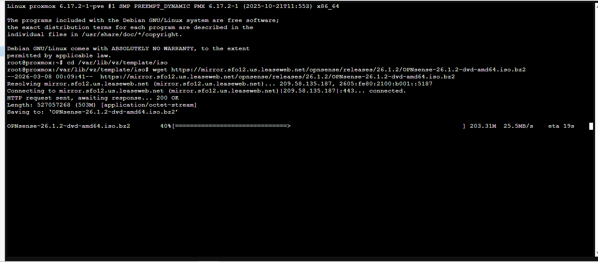
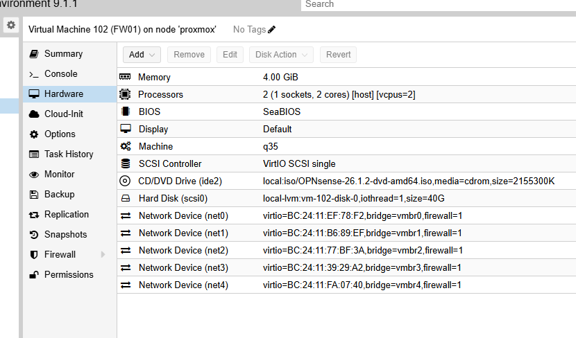
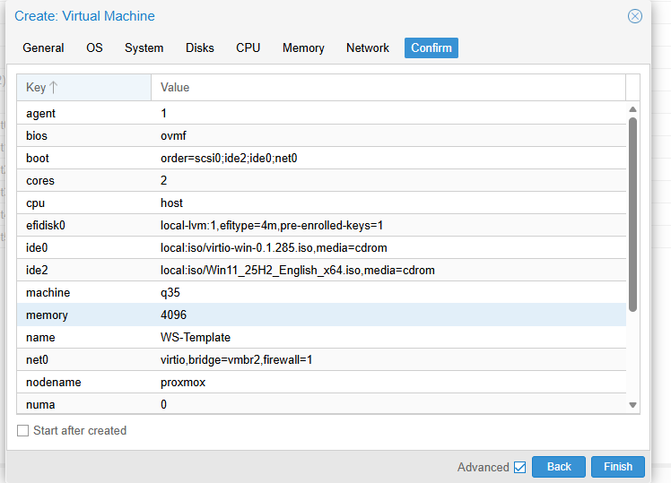

# Proxmox Host

## Physical Host Specs

| Component | Spec |
|---|---|
| CPU | AMD Threadripper 7960X (24c / 48t) |
| RAM | 128 GB |
| Storage | 2TB Samsung 990 Pro NVMe (Gen4) |
| Hypervisor | Proxmox VE 6.17.2 |
| NIC0 | Primary ethernet - vmbr0 (management network) |
| NIC1 | Secondary ethernet - vmbr6 (OPNsense internet updates only) |
| GPU | NVIDIA RTX 5060 8GB (passthrough to SIEM-01) |

## Network Bridge Configuration

Seven Linux bridges were created in Proxmox. Only vmbr0 has an IP assigned on the host. All other bridges are isolated virtual switches with no host IP. This prevents the hypervisor from being reachable across any internal segment.

```
# /etc/network/interfaces (Proxmox host)
# vmbr0 - Management (host IP assigned here only)
# vmbr1 - Domain Controller network       (no host IP)
# vmbr2 - Corporate workstation network   (no host IP)
# vmbr3 - DMZ / security sensor network   (no host IP)
# vmbr4 - Attacker network                (no host IP)
# vmbr5 - SIEM dedicated management link  (no host IP)
# vmbr6 - OPNsense internet updates only  (bridged to NIC1)
```

Assigning IPs to vmbr1 through vmbr4 would put the Proxmox host on every internal segment and create a pivot path if any VM is compromised. All inter-VLAN routing runs through FW01 exclusively.

## OPNsense ISO Download

The OPNsense ISO was downloaded directly to the Proxmox ISO store via SSH to avoid manual file transfers.

```bash
cd /var/lib/vz/template/iso
wget https://mirror.sfo12.us.leaseweb.net/opnsense/releases/26.1.2/OPNsense-26.1.2-dvd-amd64.iso.bz2
bzip2 -d OPNsense-26.1.2-dvd-amd64.iso.bz2
```



## VM Specifications

### FW01 (OPNsense)

Created with five VirtIO network interfaces, one per bridge (vmbr0 through vmbr4). SeaBIOS is used instead of UEFI since OPNsense does not require it.

| Setting | Value |
|---|---|
| Machine | q35 |
| BIOS | SeaBIOS |
| Disk | 40 GB VirtIO SCSI single |
| CPU | 2 vCPUs (host type) |
| RAM | 4 GB |
| net0 | vmbr0 |
| net1 | vmbr1 |
| net2 | vmbr2 |
| net3 | vmbr3 |
| net4 | vmbr4 |



### DC01 (Windows Server 2022)

| Setting | Value |
|---|---|
| Machine | q35 |
| BIOS | OVMF (UEFI) |
| TPM | v2.0 |
| Disk | 100 GB VirtIO SCSI single |
| CPU | 4 vCPUs (host type) |
| RAM | 8 GB |
| net0 | vmbr1 |

### WS01-WS06 (Windows 11 Pro)

All six workstations were created from a single WS-Template VM to ensure identical base configurations. After the template was configured and verified, it was cloned six times and each clone was assigned a static IP on vmbr2.

| Setting | Value |
|---|---|
| Machine | q35 |
| BIOS | OVMF (UEFI) |
| Disk | 40 GB |
| CPU | 2 vCPUs (host type) |
| RAM | 4 GB |
| net0 | vmbr2 |



### WEC-01 (Windows Server 2022)

| Setting | Value |
|---|---|
| Disk | 80 GB |
| CPU | 2 vCPUs |
| RAM | 4 GB |
| net0 | vmbr2 |

### SIEM-01 (Windows 11 + Splunk)

| Setting | Value |
|---|---|
| Disk 1 | 350 GB system disk |
| Disk 2 | 500 GB SplunkDB log partition (drive letter L:) |
| CPU | 12 vCPUs |
| RAM | 48 GB |
| net0 | vmbr0 (management) |
| net1 | vmbr5 (dedicated SIEM link) |
| GPU | RTX 5060 8GB passthrough |

### KALI-01

| Setting | Value |
|---|---|
| Disk | 60 GB |
| CPU | 4 vCPUs |
| RAM | 8 GB |
| net0 | vmbr4 |

### WIN-ATK (Windows 10)

| Setting | Value |
|---|---|
| Disk | 80 GB |
| CPU | 4 vCPUs |
| RAM | 8 GB |
| net0 | vmbr4 |

### HONEY01

| Setting | Value |
|---|---|
| Disk | 32 GB |
| CPU | 2 vCPUs |
| RAM | 4 GB |
| net0 | vmbr3 |

### ZEEK-01 (Ubuntu)

| Setting | Value |
|---|---|
| Disk | 60 GB |
| CPU | 4 vCPUs |
| RAM | 8 GB |
| net0 | vmbr3 |
