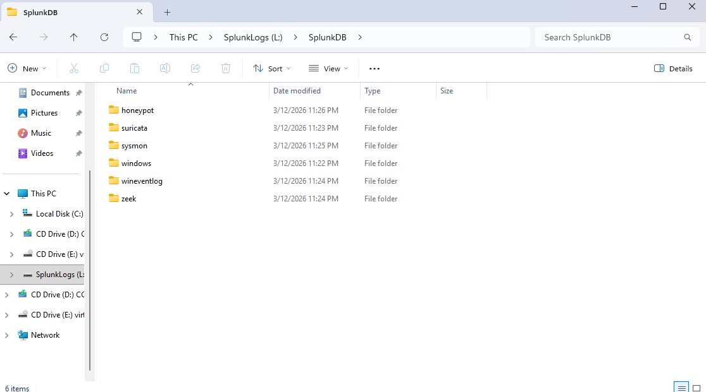
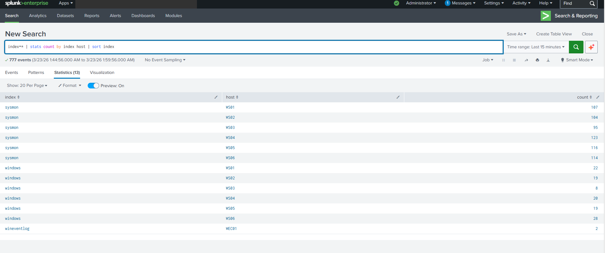
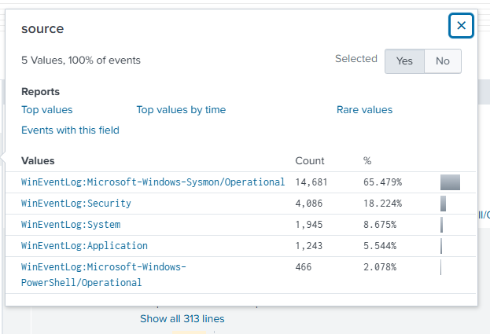
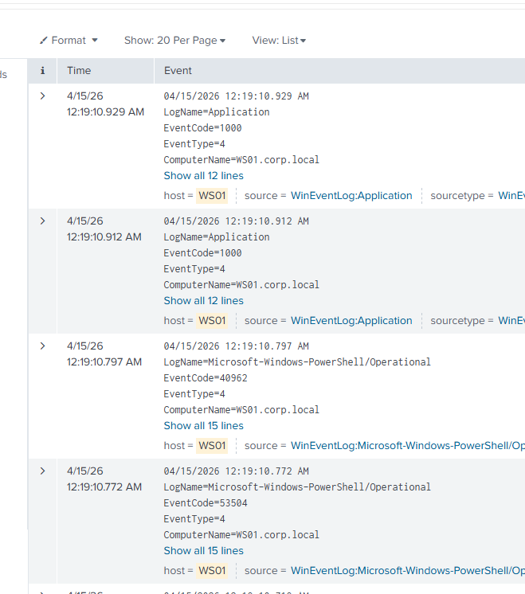
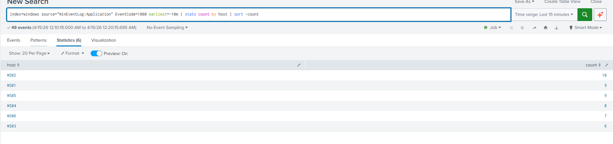
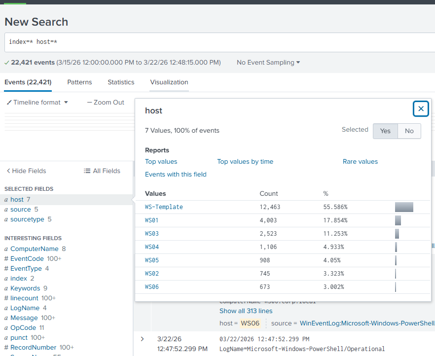
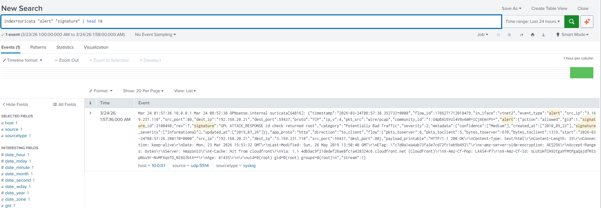

# SIEM-01 - Splunk Enterprise

**OS:** Windows 11
**IPs:** 192.168.3.106 (vmbr0), 10.0.0.10 (vmbr5)
**Role:** SOC console, SIEM, SOAR host, GPU passthrough for AI-assisted workloads

SIEM-01 has two network interfaces. The vmbr0 interface (192.168.3.106) is used for Proxmox management access and the web GUI. The vmbr5 interface (10.0.0.10) is the dedicated log ingestion link. All Universal Forwarders and WEC-01 send logs to 10.0.0.10:9997 exclusively. This architecture decouples log forwarding from every other network segment without requiring firewall exceptions on those segments.

The 500 GB SplunkDB log partition is mounted as drive L: and is separate from the 350 GB system disk.

## Splunk Installation

Splunk Enterprise was installed using a developer license. The SplunkDB directory was created on the L: partition before Splunk first started so indexes write to the log disk and not the system disk.

## Index Configuration

Six indexes were created before any forwarders connected. Each index maps to a specific log source.

| Index | Source | Forwarder |
|---|---|---|
| `sysmon` | Microsoft-Windows-Sysmon/Operational | Splunk UF on WS01-WS06 |
| `windows` | Security, System, Application, PowerShell | Splunk UF on WS01-WS06 |
| `wineventlog` | ForwardedEvents | Splunk UF on WEC-01 |
| `suricata` | Suricata EVE JSON alerts via syslog | OPNsense syslog output |
| `zeek` | Zeek conn/dns/http logs | Splunk UF on ZEEK-01 |
| `honeypot` | Cowrie JSON session logs | Splunk UF on HONEY01 |



## Receiving Configuration

Splunk was configured to listen on port 9997 on the 10.0.0.10 interface for forwarder connections.

```
Settings > Forwarding and Receiving > Configure Receiving > New Receiving Port: 9997
```

## Verified Telemetry

Once all forwarders were connected and CorpBot was running, Splunk was queried to verify events were arriving from every expected host and index.

### Index and Host Breakdown

```spl
index=** | stats count by index host | sort index
```



This query confirmed all 13 expected index-host combinations were active: `sysmon` from WS01-WS06, `windows` from WS01-WS06, and `wineventlog` from WEC01.

### Source Breakdown

```spl
index=* | stats count by source
```



Sysmon dominates at 65% of total event volume, which is expected with the SwiftOnSecurity config active on all workstations. Security events at 18% cover authentication and privilege events.

### Workstation Events Verified





### Host Distribution



### Suricata Alert Ingestion

Suricata alerts were forwarded from OPNsense to Splunk via syslog and confirmed in the `suricata` index.

```spl
index=suricata "alert" "signature" | head 10
```



The suricata index is receiving EVE JSON formatted alerts including flow ID, source/destination IP and port, signature ID, signature message, category, and severity.
