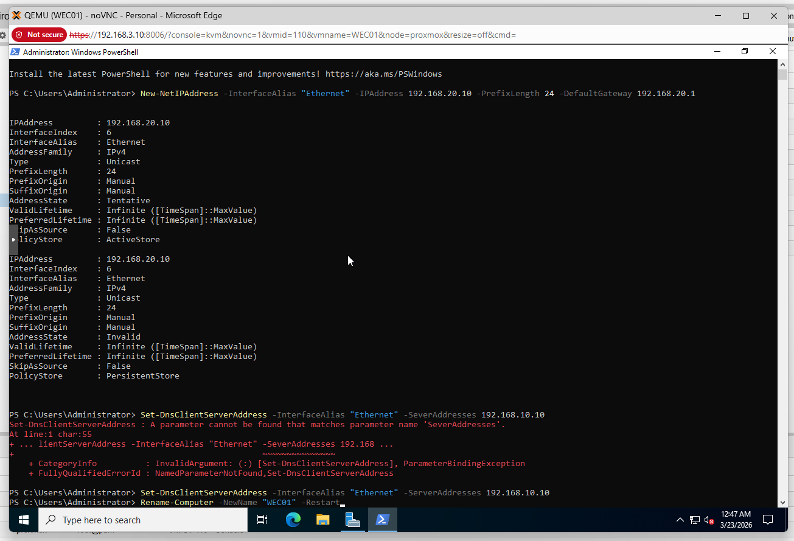
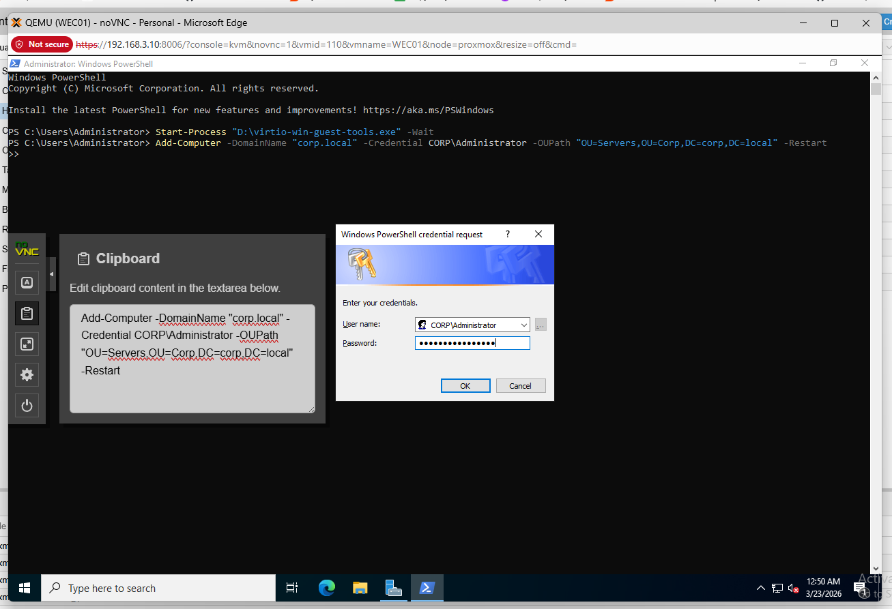
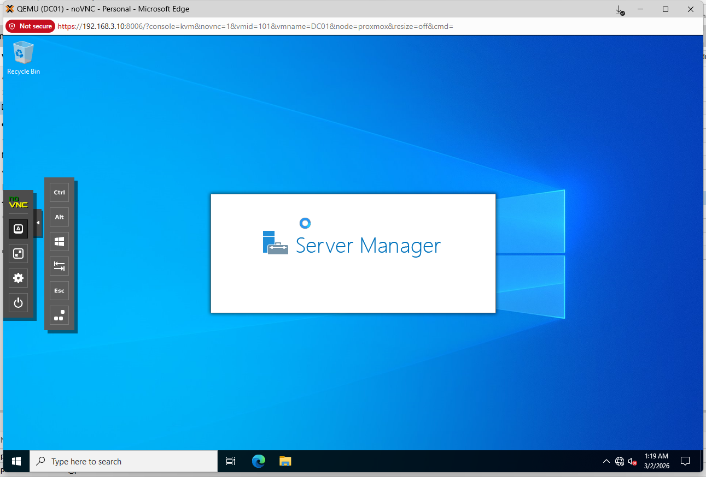

# WEC-01 - Windows Event Collector

**OS:** Windows Server 2022 (Desktop Experience)
**IP:** 192.168.20.10/24
**Gateway:** 192.168.20.1 (OPNsense LAN)
**Domain:** corp.local (Servers OU)

WEC-01 aggregates Windows event logs from all six workstations using Windows Event Forwarding (WEF) and forwards them to Splunk. Centralizing logs here is necessary because Splunk cannot maintain persistent WinRM connections to six individual hosts at scale. WEC-01 acts as a collection point and the Splunk Universal Forwarder on WEC-01 ships the ForwardedEvents log to the `wineventlog` index.

## Phase 1 - Network Configuration and Rename

```powershell
# Set static IP on vmbr2
New-NetIPAddress -InterfaceAlias "Ethernet" -IPAddress 192.168.20.10 -PrefixLength 24 -DefaultGateway 192.168.20.1
Set-DnsClientServerAddress -InterfaceAlias "Ethernet" -ServerAddresses 192.168.10.10

# Rename and restart
Rename-Computer -NewName "WEC01" -Restart
```



## Phase 2 - Domain Join

WEC-01 was joined to the corp.local domain and placed in the Servers OU.

```powershell
# Mount VirtIO ISO and install guest agent first
Start-Process "D:\virtio-win-guest-tools.exe" -Wait

# Join domain
Add-Computer -DomainName "corp.local" -Credential CORP\Administrator -OUPath "OU=Servers,OU=Corp,DC=corp,DC=local" -Restart
```



## Phase 3 - Windows Event Collector Service

After domain join, the Windows Event Collector service was configured and the WEF subscription was created. See [`/active-directory/gpo-wef`](/active-directory/gpo-wef/) for the full subscription XML and GPO configuration.

```powershell
# Configure and start the Windows Event Collector service
winrm quickconfig -q
sc config wecsvc start=auto
net start wecsvc
```



## Phase 4 - Splunk Universal Forwarder

The Splunk UF was installed on WEC-01 and configured to forward the ForwardedEvents log to the `wineventlog` index on SIEM-01. This is the log that receives WEF-collected events from all workstations.

```powershell
# inputs.conf for WEC-01 Splunk UF
# Collects only the ForwardedEvents channel - workstation events arrive here via WEF

$inputsConf = @"
[WinEventLog://ForwardedEvents]
index = wineventlog
disabled = 0
renderXml = 0
"@

$inputsConf | Out-File -FilePath "C:\Program Files\SplunkUniversalForwarder\etc\system\local\inputs.conf" -Encoding UTF8

# Point UF to SIEM-01 on the management link
$outputsConf = @"
[tcpout]
defaultGroup = siem

[tcpout:siem]
server = 10.0.0.10:9997
"@

$outputsConf | Out-File -FilePath "C:\Program Files\SplunkUniversalForwarder\etc\system\local\outputs.conf" -Encoding UTF8

Restart-Service SplunkForwarder
```

> WEC-01 forwards only to the SIEM management link (10.0.0.10) on vmbr5, not through the production network. This was the purpose of the dedicated management bridge: decouple log forwarding from the segments that contain workstations and the DC so that firewall rules do not need to be loosened on those segments.
