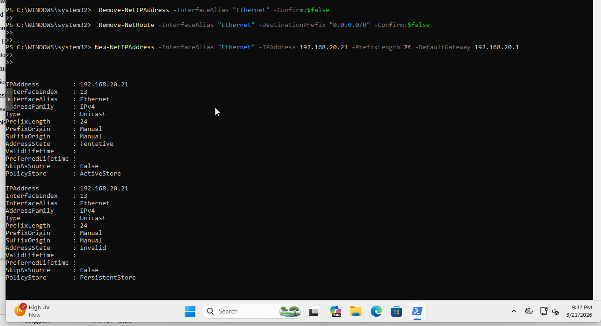
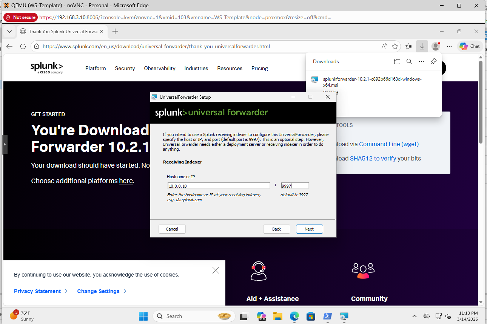
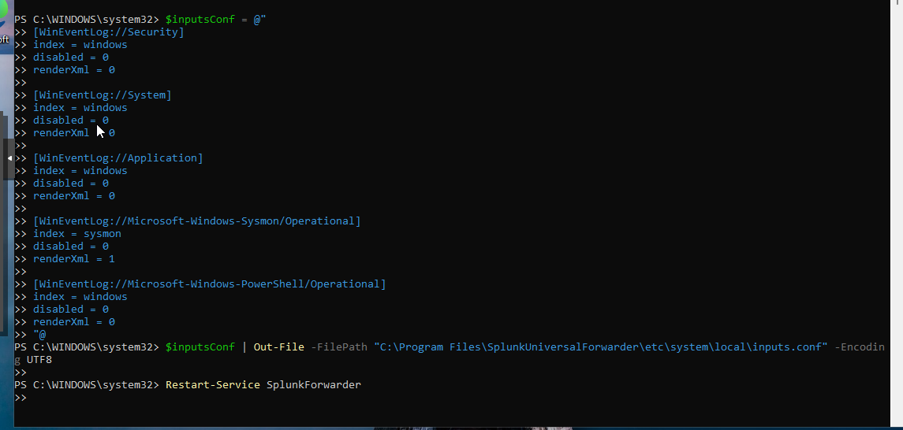
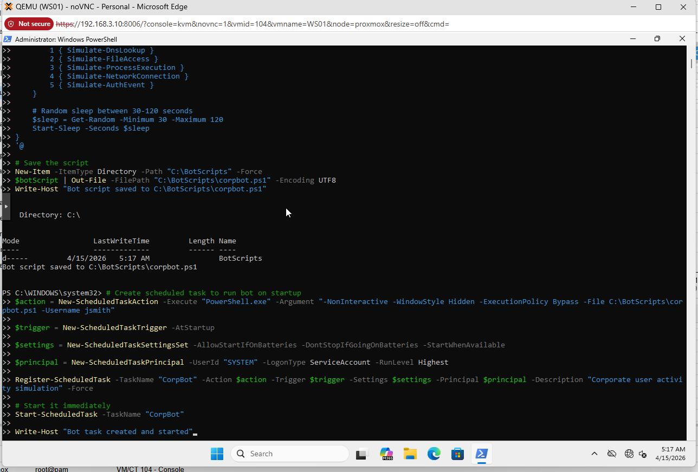
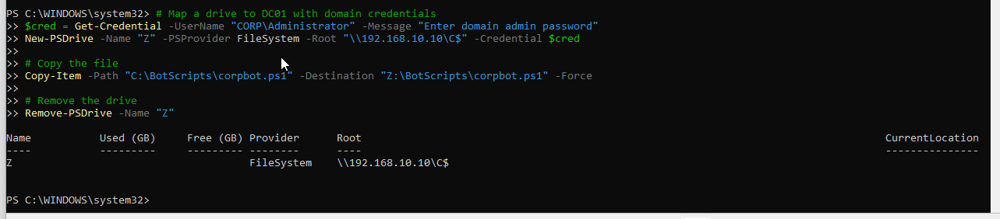

# Workstations - WS01 through WS06

**OS:** Windows 11 Pro
**Bridge:** vmbr2 (192.168.20.0/24)
**Domain:** corp.local (Workstations OU)

Six workstations simulate the corporate employee population. Each runs Sysmon for endpoint telemetry, the Splunk Universal Forwarder to ship logs to SIEM-01, and CorpBot to generate continuous baseline user activity. The WEF GPO pushed from DC01 additionally configures each workstation to forward Windows event logs to WEC-01.

## IP Assignments

| VM | IP |
|---|---|
| WS01 | 192.168.20.21 |
| WS02 | 192.168.20.22 |
| WS03 | 192.168.20.23 |
| WS04 | 192.168.20.24 |
| WS05 | 192.168.20.25 |
| WS06 | 192.168.20.26 |

## Phase 1 - Template Build

A WS-Template VM was built first with Windows 11 Pro, VirtIO guest tools, and a static IP. After the template was verified, it was cloned six times. Each clone received a unique hostname and IP.

The WS-Template VM was created in Proxmox with a VirtIO NIC on vmbr2, 4 GB RAM, 2 vCPUs, and a 40 GB VirtIO SCSI disk.


## Phase 2 - Static IP Configuration

Each workstation was assigned a static IP after cloning. The template initially had DHCP enabled; this was removed and a static address was set per machine.

```powershell
# Example for WS01 - repeat for each clone with incrementing IP
Remove-NetIPAddress -InterfaceAlias "Ethernet" -Confirm:$false
Remove-NetRoute -InterfaceAlias "Ethernet" -DestinationPrefix "0.0.0.0/0" -Confirm:$false

New-NetIPAddress -InterfaceAlias "Ethernet" -IPAddress 192.168.20.21 -PrefixLength 24 -DefaultGateway 192.168.20.1
Set-DnsClientServerAddress -InterfaceAlias "Ethernet" -ServerAddresses 192.168.10.10
```



## Phase 3 - Domain Join

Each workstation was joined to corp.local and placed in the Workstations OU. The WEF and NTP GPOs applied automatically on join.

```powershell
Add-Computer -DomainName "corp.local" -Credential CORP\Administrator -OUPath "OU=Workstations,OU=Corp,DC=corp,DC=local" -Restart
```

## Phase 4 - Sysmon

Sysmon was installed on every workstation using the SwiftOnSecurity configuration. This provides process creation, network connection, file creation, and registry event telemetry. Sysmon events go to the Microsoft-Windows-Sysmon/Operational channel, which the Splunk UF ships to the `sysmon` index.

```powershell
# Download and install Sysmon with SwiftOnSecurity config
Invoke-WebRequest -Uri "https://download.sysinternals.com/files/Sysmon.zip" -OutFile "C:\sysmon.zip"
Expand-Archive -Path "C:\sysmon.zip" -DestinationPath "C:\Sysmon"

Invoke-WebRequest -Uri "https://raw.githubusercontent.com/SwiftOnSecurity/sysmon-config/master/sysmonconfig-export.xml" -OutFile "C:\Sysmon\sysmonconfig.xml"

C:\Sysmon\Sysmon64.exe -accepteula -i C:\Sysmon\sysmonconfig.xml
```

## Phase 5 - Splunk Universal Forwarder

The UF was downloaded from Splunk.com and installed on each workstation. The inputs.conf configuration sends Security, System, and Application logs to the `windows` index and Sysmon logs to the `sysmon` index. PowerShell Operational logs also go to `windows`.



```powershell
# inputs.conf applied to each workstation UF
$inputsConf = @"
[WinEventLog://Security]
index = windows
disabled = 0
renderXml = 0

[WinEventLog://System]
index = windows
disabled = 0
renderXml = 0

[WinEventLog://Application]
index = windows
disabled = 0
renderXml = 0

[WinEventLog://Microsoft-Windows-Sysmon/Operational]
index = sysmon
disabled = 0
renderXml = 1

[WinEventLog://Microsoft-Windows-PowerShell/Operational]
index = windows
disabled = 0
renderXml = 0
"@

$inputsConf | Out-File -FilePath "C:\Program Files\SplunkUniversalForwarder\etc\system\local\inputs.conf" -Encoding UTF8
Restart-Service SplunkForwarder
```



All UFs point to 10.0.0.10:9997 (SIEM-01 on the management link) via the same outputs.conf pattern used on WEC-01.

## Phase 6 - CorpBot

CorpBot is a PowerShell script that runs as a scheduled task on every workstation. It continuously generates realistic user activity including DNS lookups, file access, process execution, network connections, and authentication events. This baseline traffic is essential before running attack simulations. Running attacks against workstations with no prior activity produces trivially detectable anomalies because every event stands out against a silent baseline.

CorpBot was written to WS01 first, then distributed to all six workstations by copying the script to DC01's admin share and then deploying from there.

```powershell
# On WS01 - save CorpBot and create the scheduled task
New-Item -ItemType Directory -Path "C:\BotScripts" -Force

# (Script content written to C:\BotScripts\corpbot.ps1)

$action    = New-ScheduledTaskAction -Execute "PowerShell.exe" -Argument "-NonInteractive -WindowStyle Hidden -ExecutionPolicy Bypass -File C:\BotScripts\corpbot.ps1 -Username jsmith"
$trigger   = New-ScheduledTaskTrigger -AtStartup
$settings  = New-ScheduledTaskSettingsSet -AllowStartIfOnBatteries -DontStopIfGoingOnBatteries -StartWhenAvailable
$principal = New-ScheduledTaskPrincipal -UserId "SYSTEM" -LogonType ServiceAccount -RunLevel Highest

Register-ScheduledTask -TaskName "CorpBot" -Action $action -Trigger $trigger -Settings $settings -Principal $principal -Description "Corporate user activity simulation" -Force
Start-ScheduledTask -TaskName "CorpBot"
```



CorpBot was then distributed to the remaining workstations via the DC01 admin share and registered under each workstation's assigned user account.



CorpBot simulates five activity types in a random loop with random sleep intervals (30-120 seconds between actions):

- `Simulate-DnsLookup` - DNS queries to internal and external hostnames
- `Simulate-FileAccess` - File read/write operations on the local filesystem
- `Simulate-ProcessExecution` - Spawning common Windows processes
- `Simulate-NetworkConnection` - TCP connection attempts to internal IPs
- `Simulate-AuthEvent` - LDAP bind and authentication activity against DC01
